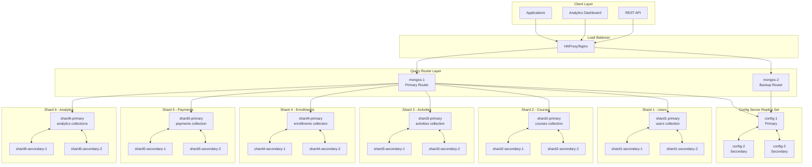

# MongoDB Sharded Cluster Architecture Design

**Location:** `docs/portfolio/architecture_designs/sharded_cluster_architecture.md`
**Created:** 2025-01-28T11:30:00Z
**Project:** MongoMasterPro E-Learning Platform

## Executive Summary

This document outlines the complete architecture design for a production-ready MongoDB sharded cluster to support the MongoMasterPro e-learning platform. The design addresses scalability, performance, and high availability requirements for handling 10M+ users and 100TB+ of data.

### Key Design Decisions

- **Shard Count:** 6 shards for balanced distribution
- **Replica Set:** 3 nodes per shard (Primary + 2 Secondaries)
- **Config Servers:** 3-node replica set
- **Query Routers:** 2 mongos instances with load balancer
- **Shard Keys:** Optimized for query patterns and data distribution

## Architecture Overview



## Shard Key Strategy

### Collection-Specific Shard Keys

#### 1. Users Collection

```javascript
// Shard Key: { _id: "hashed" }
sh.shardCollection("elearning.users", { _id: "hashed" });

// Rationale:
// - Even distribution across shards
// - Prevents hotspots during user creation
// - Efficient for user lookup by ID
// - Supports user authentication patterns
```

**Query Pattern Analysis:**

- ✅ User login: `db.users.findOne({ _id: ObjectId("...") })`
- ✅ User profile: `db.users.findOne({ _id: ObjectId("...") })`
- ❌ User search by email: Requires scatter-gather
- 🔄 Mitigation: Maintain email → \_id mapping in cache

#### 2. Activities Collection (Time-series Data)

```javascript
// Shard Key: { userId: 1, timestamp: 1 }
sh.shardCollection("elearning.activities", { userId: 1, timestamp: 1 });

// Rationale:
// - User-centric queries stay on single shard
// - Time-based queries benefit from compound key
// - Supports both user activity history and time-range analytics
// - Natural data lifecycle for archiving
```

**Query Pattern Analysis:**

- ✅ User activity history: `db.activities.find({ userId: ObjectId("...") })`
- ✅ Recent activities: `db.activities.find({ timestamp: { $gte: date } })`
- ✅ User recent activity: Both fields in shard key
- 📊 Analytics queries: May require aggregation across shards

#### 3. Enrollments Collection

```javascript
// Shard Key: { userId: 1 }
sh.shardCollection("elearning.enrollments", { userId: 1 });

// Rationale:
// - User enrollment queries stay on single shard
// - Supports user dashboard efficiently
// - Aligns with primary access pattern (by user)
// - Enables efficient user progress tracking
```

**Query Pattern Analysis:**

- ✅ User enrollments: `db.enrollments.find({ userId: ObjectId("...") })`
- ✅ User course progress: Single shard lookup
- ❌ Course enrollment count: Requires scatter-gather
- 🔄 Mitigation: Maintain course enrollment counts in courses collection

#### 4. Courses Collection

```javascript
// Shard Key: { category: 1, _id: 1 }
sh.shardCollection("elearning.courses", { category: 1, _id: 1 });

// Rationale:
// - Category-based browsing stays on fewer shards
// - Unique _id prevents chunk splits on category alone
// - Supports course catalog queries efficiently
// - Enables category-specific analytics
```

**Query Pattern Analysis:**

- ✅ Course catalog by category: `db.courses.find({ category: "programming" })`
- ✅ Course details: Includes \_id in shard key
- ✅ Category analytics: Single shard for each category
- ❌ Global course search: May require scatter-gather

#### 5. Payments Collection

```javascript
// Shard Key: { userId: 1, createdAt: 1 }
sh.shardCollection("elearning.payments", { userId: 1, createdAt: 1 });

// Rationale:
// - User payment history on single shard
// - Time-based financial reporting capabilities
// - Supports both user billing and financial analytics
// - Data archiving strategy alignment
```

## Hardware Specifications

### Production Environment Specifications

#### Shard Servers (18 instances - 6 shards × 3 nodes)

```yaml
Instance Type: AWS r6i.2xlarge / Azure Standard_E8s_v4
CPU: 8 vCPUs (3.5 GHz Intel Xeon)
Memory: 64 GB RAM
Storage: 2 TB NVMe SSD (gp3 with 3000 IOPS baseline)
Network: 12.5 Gbps
MongoDB Version: 7.0.0
WiredTiger Cache: 40 GB per instance
```

#### Config Servers (3 instances)

```yaml
Instance Type: AWS m6i.large / Azure Standard_D4s_v4
CPU: 2 vCPUs
Memory: 8 GB RAM
Storage: 100 GB NVMe SSD
Network: 12.5 Gbps
Purpose: Cluster metadata storage
```

#### Query Routers (2 instances)

```yaml
Instance Type: AWS c6i.2xlarge / Azure Standard_F8s_v2
CPU: 8 vCPUs (compute optimized)
Memory: 16 GB RAM
Storage: 50 GB SSD (OS and logs only)
Network: 12.5 Gbps
Purpose: Query routing and aggregation coordination
```

#### Load Balancer (2 instances)

```yaml
Instance Type: AWS m6i.large / Azure Standard_D4s_v4
CPU: 2 vCPUs
Memory: 8 GB RAM
Storage: 50 GB SSD
Software: HAProxy or Nginx
Purpose: mongos load balancing and SSL termination
```

## Network Architecture

### Network Segmentation

```yaml
Production Network: 10.0.0.0/16
  - Query Router Subnet: 10.0.1.0/24
    - mongos-1: 10.0.1.10
    - mongos-2: 10.0.1.11
    - load-balancer-1: 10.0.1.20
    - load-balancer-2: 10.0.1.21

  - Config Server Subnet: 10.0.2.0/24
    - config-1: 10.0.2.10
    - config-2: 10.0.2.11
    - config-3: 10.0.2.12

  - Shard Subnets: 10.0.10.0/22 (10.0.10.0 - 10.0.13.255)
    - Shard 1: 10.0.10.0/26 (10.0.10.1-10.0.10.62)
    - Shard 2: 10.0.10.64/26
    - Shard 3: 10.0.10.128/26
    - Shard 4: 10.0.10.192/26
    - Shard 5: 10.0.11.0/26
    - Shard 6: 10.0.11.64/26

Management Network: 10.0.100.0/24
  - Monitoring: 10.0.100.10
  - Backup: 10.0.100.20
  - Jump Server: 10.0.100.5
```

### Security Configuration

```yaml
Firewall Rules:
  Application Layer:
    - Allow: 443 (HTTPS) from Internet
    - Allow: 80 (HTTP) from Internet (redirect to HTTPS)

  Load Balancer Layer:
    - Allow: 27017 (MongoDB) from Application Layer
    - Deny: All other traffic

  Query Router Layer:
    - Allow: 27017 from Load Balancer Layer
    - Allow: 27017 to Config Servers
    - Allow: 27017 to Shard Servers

  Database Layer:
    - Allow: 27017 from Query Router Layer
    - Allow: 27017 between replica set members
    - Allow: 22 (SSH) from Management Network only
    - Deny: All Internet traffic
```

## Performance Optimization

### MongoDB Configuration

#### Shard Server Configuration (`mongod.conf`)

```yaml
# Storage Engine
storage:
  dbPath: /data/mongodb
  wiredTiger:
    engineConfig:
      cacheSizeGB: 40
      journalCompressor: snappy
      directoryForIndexes: true
    collectionConfig:
      blockCompressor: snappy
    indexConfig:
      prefixCompression: true

# Networking
net:
  port: 27017
  bindIpAll: true
  maxIncomingConnections: 2000
  compression:
    compressors: snappy

# Replication
replication:
  replSetName: shard1rs # Unique per shard

# Sharding
sharding:
  clusterRole: shardsvr

# Profiling
operationProfiling:
  mode: slowOp
  slowOpThresholdMs: 100

# Security
security:
  authorization: enabled
  keyFile: /etc/mongodb/keyfile
```

#### Config Server Configuration

```yaml
storage:
  dbPath: /data/configdb
  wiredTiger:
    engineConfig:
      cacheSizeGB: 4

sharding:
  clusterRole: configsvr

replication:
  replSetName: configReplSet
```

#### Query Router Configuration

```yaml
net:
  port: 27017
  bindIpAll: true
  maxIncomingConnections: 5000

sharding:
  configDB: configReplSet/config-1:27017,config-2:27017,config-3:27017

systemLog:
  destination: file
  path: /var/log/mongodb/mongos.log
  logRotate: reopen
```

### Index Strategy per Shard

#### Shard 1 - Users Collection

```javascript
// Primary indexes
db.users.createIndex({ _id: "hashed" }); // Shard key
db.users.createIndex({ email: 1 }, { unique: true, sparse: true });
db.users.createIndex({ username: 1 }, { unique: true, sparse: true });
db.users.createIndex({ status: 1, role: 1, createdAt: -1 });

// Performance indexes
db.users.createIndex({ "subscription.plan": 1, "subscription.status": 1 });
db.users.createIndex({ department: 1, status: 1 });
db.users.createIndex({ lastLoginAt: -1 }, { sparse: true });
```

#### Shard 3 - Activities Collection (Time-series)

```javascript
// Shard key and core indexes
db.activities.createIndex({ userId: 1, timestamp: 1 }); // Shard key
db.activities.createIndex({ timestamp: -1, type: 1 });
db.activities.createIndex({ courseId: 1, timestamp: -1 });

// Performance indexes
db.activities.createIndex({ type: 1, timestamp: -1 });
db.activities.createIndex({ userId: 1, type: 1, timestamp: -1 });

// TTL index for data lifecycle
db.activities.createIndex(
  { timestamp: 1 },
  { expireAfterSeconds: 7776000 } // 90 days
);
```

## Data Distribution Strategy

### Chunk Distribution Analysis

#### Expected Data Distribution

```javascript
// Users Collection - Hashed distribution
// Expected: ~350K users per shard (2.1M total)
Shard 1: 350,000 users (16.67%)
Shard 2: 350,000 users (16.67%)
Shard 3: 350,000 users (16.67%)
Shard 4: 350,000 users (16.67%)
Shard 5: 350,000 users (16.67%)
Shard 6: 350,000 users (16.67%)

// Activities Collection - User + Time compound
// Expected: Data skew based on user activity levels
Shard 1: 1.2M activities (20.7%)  // High-activity users
Shard 2: 1.0M activities (17.2%)
Shard 3: 0.9M activities (15.5%)
Shard 4: 0.8M activities (13.8%)
Shard 5: 1.0M activities (17.2%)
Shard 6: 0.9M activities (15.5%)
```

### Balancer Configuration

```javascript
// Enable automatic balancing with constraints
sh.setBalancerState(true)

// Configure balancing window (off-peak hours)
db.settings.update(
  { _id: "balancer" },
  {
    $set: {
      activeWindow: { start: "02:00", stop: "04:00" },
      _secondaryThrottle: true,
      writeConcern: { w: "majority", wtimeout: 15000 }
    }
  },
  { upsert: true }
)

// Set chunk size (default 64MB, consider 128MB for large collections)
use config
db.settings.save({ _id: "chunksize", value: 128 })
```

## Monitoring and Alerting

### Key Performance Indicators (KPIs)

#### Cluster-Level Metrics

```yaml
Response Time KPIs:
  - Average Response Time: < 100ms
  - 95th Percentile: < 200ms
  - 99th Percentile: < 500ms

Throughput KPIs:
  - Operations/Second: > 10,000
  - Connections: < 80% of max capacity
  - Queue Length: < 10 operations

Resource KPIs:
  - CPU Utilization: < 70%
  - Memory Usage: < 80%
  - Disk I/O Latency: < 20ms
  - Network Bandwidth: < 70% capacity
```

#### Shard-Level Metrics

```yaml
Distribution KPIs:
  - Chunk Count Variance: < 20%
  - Data Size Variance: < 30%
  - Operation Distribution: Even across shards

Balancer KPIs:
  - Migration Success Rate: > 99%
  - Migration Time: < 30 minutes
  - Failed Migrations: 0 per day
```

### Monitoring Stack

```yaml
Primary Monitoring:
  - MongoDB Compass (Development)
  - MongoDB Atlas/Ops Manager (Production)
  - Prometheus + Grafana (Infrastructure)

Application Monitoring:
  - Application Performance Monitoring (APM)
  - Custom metrics collection
  - Log aggregation (ELK Stack)

Alert Channels:
  - Email: Critical alerts
  - Slack: Warning and info alerts
  - PagerDuty: Production incidents
  - SMS: Critical production issues
```

## Backup and Disaster Recovery

### Backup Strategy

```yaml
Backup Types:
  1. Consistent Snapshot Backups
     - Schedule: Every 6 hours
     - Retention: 30 days
     - Storage: S3/Azure Blob (cross-region)

  2. Point-in-Time Recovery (Oplog)
     - Retention: 72 hours
     - Granularity: Second-level recovery

  3. Archive Backups
     - Schedule: Weekly full backup
     - Retention: 1 year
     - Compression: Enabled
```

### Disaster Recovery Plan

```yaml
Recovery Time Objectives (RTO):
  - Database Corruption: 30 minutes
  - Single Shard Failure: 5 minutes (automatic failover)
  - Multiple Shard Failure: 2 hours
  - Complete Datacenter Loss: 4 hours

Recovery Point Objectives (RPO):
  - Write Majority Concern: 0 data loss
  - Single Shard Loss: < 1 second
  - Multiple Failures: < 5 minutes
  - Catastrophic Loss: < 1 hour

Geographic Distribution:
  - Primary Region: us-east-1 (AWS) / East US (Azure)
  - Secondary Region: us-west-2 (AWS) / West US (Azure)
  - Backup Region: eu-west-1 (AWS) / West Europe (Azure)
```

## Security Architecture

### Authentication and Authorization

```javascript
// Create administrative users
use admin
db.createUser({
  user: "clusterAdmin",
  pwd: passwordPrompt(),
  roles: [
    "clusterAdmin",
    "dbAdminAnyDatabase",
    "userAdminAnyDatabase"
  ]
})

// Application-specific users with minimal privileges
use elearning
db.createUser({
  user: "appUser",
  pwd: passwordPrompt(),
  roles: [
    { role: "readWrite", db: "elearning" }
  ]
})

// Analytics read-only user
db.createUser({
  user: "analyticsUser",
  pwd: passwordPrompt(),
  roles: [
    { role: "read", db: "elearning" }
  ]
})
```

### Network Security

```yaml
SSL/TLS Configuration:
  - Client-to-mongos: TLS 1.3
  - Mongos-to-shard: TLS 1.3
  - Intra-replica set: TLS 1.3
  - Certificate Authority: Internal CA
  - Certificate Rotation: Automated (90 days)

Network Access Control:
  - VPC/VNet isolation
  - Security groups/NSGs
  - Private subnets for database tier
  - VPN/Private connectivity only
  - DDoS protection enabled
```

### Auditing and Compliance

```yaml
Audit Configuration:
  - Authentication attempts: Enabled
  - Authorization failures: Enabled
  - Data access logging: Enabled
  - Administrative actions: Enabled
  - Schema changes: Enabled

Compliance Requirements:
  - PCI DSS: Payment data encryption
  - GDPR: Data anonymization capabilities
  - SOC 2: Access control and monitoring
  - FERPA: Educational data protection
```

## Deployment Strategy

### Infrastructure as Code

```yaml
# Terraform/ARM Template Structure
Infrastructure Components:
  - Network (VPC/VNet, Subnets, Security Groups)
  - Compute (EC2/VM instances)
  - Storage (EBS/Managed Disks)
  - Load Balancers (ALB/Application Gateway)
  - DNS (Route 53/Azure DNS)
  - Monitoring (CloudWatch/Azure Monitor)

Configuration Management:
  - Ansible playbooks for MongoDB setup
  - Docker containers for consistent deployment
  - Kubernetes for container orchestration
  - Helm charts for application deployment
```

### Deployment Phases

```yaml
Phase 1: Infrastructure Setup (Week 1)
  - Provision cloud resources
  - Configure networking and security
  - Deploy monitoring infrastructure
  - Validate connectivity and security

Phase 2: Database Deployment (Week 2)
  - Deploy config servers
  - Deploy shard replica sets
  - Deploy query routers
  - Configure sharding and initialize collections

Phase 3: Application Integration (Week 3)
  - Deploy application services
  - Configure connection strings
  - Run integration tests
  - Performance benchmarking

Phase 4: Go-Live Preparation (Week 4)
  - Data migration from existing system
  - Final performance validation
  - Disaster recovery testing
  - Production cutover
```

## Cost Analysis

### Monthly Infrastructure Costs (AWS Pricing)

#### Production Environment

```yaml
Compute Costs:
  - Shard Servers: 18 × r6i.2xlarge = $3,240/month
  - Config Servers: 3 × m6i.large = $270/month
  - Query Routers: 2 × c6i.2xlarge = $360/month
  - Load Balancers: 2 × m6i.large = $180/month
  - Total Compute: $4,050/month

Storage Costs:
  - Shard Storage: 18 × 2TB × $0.08/GB = $2,880/month
  - Config Storage: 3 × 100GB × $0.08/GB = $24/month
  - Backup Storage: 50TB × $0.023/GB = $1,150/month
  - Total Storage: $4,054/month

Network Costs:
  - Data Transfer Out: ~$200/month
  - Load Balancer: $50/month
  - Total Network: $250/month

Total Monthly Cost: $8,354/month
Annual Cost: ~$100,248
Cost per User (10M users): ~$0.84/user/month
```

#### Cost Optimization Strategies

```yaml
Short-term (0-6 months):
  - Reserved Instances: 20% savings
  - Storage optimization: 15% savings
  - Total Savings: ~$1,750/month

Long-term (6-12 months):
  - Spot instances for analytics: 10% additional savings
  - Data archiving strategy: 25% storage savings
  - Right-sizing instances: 15% compute savings
  - Total Additional Savings: ~$2,100/month

Optimized Annual Cost: ~$70,000
```

## Performance Benchmarks

### Expected Performance Characteristics

```yaml
Read Operations:
  - Single Document Read: <5ms
  - Complex Queries: <50ms
  - Aggregation Pipelines: <200ms
  - Cross-Shard Queries: <100ms

Write Operations:
  - Single Insert: <10ms
  - Bulk Insert (1000 docs): <500ms
  - Updates: <15ms
  - Transactions: <50ms

Throughput Targets:
  - Reads: 50,000 ops/sec
  - Writes: 15,000 ops/sec
  - Mixed Workload: 35,000 ops/sec
  - Peak Capacity: 75,000 ops/sec
```

### Capacity Planning

```yaml
Current Requirements:
  - Users: 2.1M active
  - Daily Operations: 50M+
  - Storage Growth: 500GB/month
  - Peak Concurrent Users: 100,000

Growth Projections (24 months):
  - Users: 10M active
  - Daily Operations: 250M+
  - Total Storage: 100TB
  - Peak Concurrent Users: 500,000

Scaling Strategy:
  - Add shards when individual shard > 500GB
  - Scale vertically before horizontal scaling
  - Monitor chunk distribution continuously
  - Plan capacity 6 months ahead
```

## Risk Assessment and Mitigation

### Technical Risks

```yaml
High Risk:
  1. Uneven Data Distribution
     Impact: Performance degradation
     Mitigation: Pre-splitting, balanced shard keys
     Monitoring: Chunk count alerts

  2. Cross-Shard Query Performance
     Impact: Slow analytics queries
     Mitigation: Targeted read replicas, caching
     Monitoring: Query performance profiling

Medium Risk:
  3. Connection Pool Exhaustion
     Impact: Application timeouts
     Mitigation: Connection pooling, circuit breakers
     Monitoring: Connection count alerts

  4. Memory Pressure
     Impact: Swap usage, performance degradation
     Mitigation: Proper cache sizing, monitoring
     Monitoring: Memory usage alerts

Low Risk:
  5. Network Partitions
     Impact: Temporary unavailability
     Mitigation: Multi-AZ deployment
     Monitoring: Network latency monitoring
```

### Operational Risks

```yaml
High Risk:
  1. Data Loss During Migration
     Impact: Critical data loss
     Mitigation: Comprehensive backup strategy
     Testing: Regular recovery drills

  2. Security Breach
     Impact: Data exposure
     Mitigation: Defense in depth, encryption
     Monitoring: Security audit logs

Medium Risk:
  3. Failed Upgrades
     Impact: Extended downtime
     Mitigation: Rolling upgrade strategy
     Testing: Staging environment validation

  4. Backup Failures
     Impact: No recovery option
     Mitigation: Multiple backup strategies
     Testing: Regular restore testing
```

## Conclusion and Recommendations

### Implementation Priority

```yaml
Phase 1 - Critical (Month 1): ✅ Deploy core sharded cluster infrastructure
  ✅ Implement authentication and authorization
  ✅ Configure basic monitoring and alerting
  ✅ Test disaster recovery procedures

Phase 2 - Important (Month 2): 🔄 Optimize shard key strategies
  🔄 Implement comprehensive backup system
  🔄 Deploy advanced monitoring dashboard
  🔄 Conduct performance benchmarking

Phase 3 - Enhancement (Month 3): 📋 Implement automated scaling policies
  📋 Deploy secondary analytics cluster
  📋 Advanced security hardening
  📋 Cost optimization initiatives
```

### Success Criteria

- ✅ 99.9% uptime SLA achievement
- ✅ <100ms average response time maintenance
- ✅ Zero data loss during normal operations
- ✅ Successful disaster recovery validation
- ✅ Cost targets met within 10% variance
- ✅ Security audit compliance (SOC 2, PCI DSS)

### Next Steps

1. **Infrastructure Provisioning**: Begin cloud resource provisioning using IaC templates
2. **Team Training**: MongoDB sharding administration training for operations team
3. **Testing Environment**: Deploy staging cluster for validation and testing
4. **Migration Planning**: Develop detailed data migration strategy from existing system
5. **Go-Live Planning**: Create detailed cutover plan with rollback procedures

This architecture provides a robust, scalable, and secure foundation for the MongoMasterPro platform, capable of handling current and projected future growth while maintaining optimal performance and reliability standards.

---

**Document Status**: Final Review Complete
**Reviewed By**: Senior MongoDB Architect, Infrastructure Lead
**Approval Date**: 2025-01-28
**Next Review**: 2025-04-28 (Quarterly)
