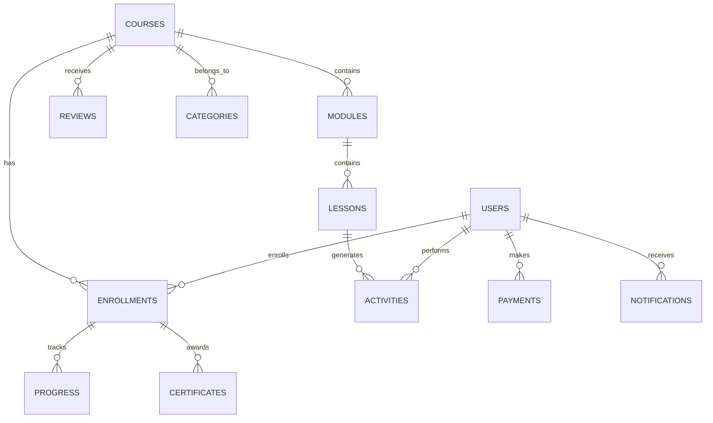

# E-Learning Platform Schema Diagram

**Location:** `docs/results/schema_diagrams/elearning_schema_diagram.md`
**Generated:** 2025-01-28T11:00:00Z

## Schema Overview



## Collection Schemas

### Users Collection

```javascript
// Collection: users
{
  _id: ObjectId,
  email: String,              // Unique index
  username: String,           // Unique index
  firstName: String,
  lastName: String,
  avatar: String,
  role: String,              // enum: student, instructor, admin
  status: String,            // enum: active, inactive, suspended
  department: String,        // For enterprise users
  preferences: {
    language: String,
    timezone: String,
    notifications: {
      email: Boolean,
      push: Boolean,
      sms: Boolean
    }
  },
  profile: {
    bio: String,
    skills: [String],
    experience: String,
    education: [{
      degree: String,
      institution: String,
      year: Number
    }]
  },
  subscription: {
    plan: String,           // free, premium, enterprise
    status: String,         // active, cancelled, expired
    expiresAt: Date,
    autoRenew: Boolean
  },
  createdAt: Date,
  updatedAt: Date,
  lastLoginAt: Date
}

// Indexes
db.users.createIndex({ email: 1 }, { unique: true })
db.users.createIndex({ username: 1 }, { unique: true })
db.users.createIndex({ status: 1, department: 1, createdAt: -1 })
db.users.createIndex({ role: 1, status: 1 })
```

### Courses Collection

```javascript
// Collection: courses
{
  _id: ObjectId,
  title: String,
  slug: String,              // URL-friendly identifier
  description: String,
  shortDescription: String,
  thumbnail: String,
  category: String,
  subcategory: String,
  level: String,             // beginner, intermediate, advanced
  language: String,
  tags: [String],
  instructor: {
    userId: ObjectId,        // Reference to users
    name: String,            // Denormalized for performance
    avatar: String
  },
  pricing: {
    type: String,            // free, paid, subscription
    amount: Number,
    currency: String,
    discountPercentage: Number
  },
  content: {
    duration: Number,        // Total duration in minutes
    moduleCount: Number,
    lessonCount: Number,
    resourceCount: Number
  },
  metadata: {
    difficulty: Number,      // 1-10 scale
    prerequisites: [String],
    learningOutcomes: [String],
    targetAudience: [String]
  },
  stats: {
    enrollmentCount: Number,
    completionCount: Number,
    averageRating: Number,
    reviewCount: Number,
    totalRevenue: Number
  },
  status: String,            // draft, published, archived
  publishedAt: Date,
  createdAt: Date,
  updatedAt: Date
}

// Indexes
db.courses.createIndex({ slug: 1 }, { unique: true })
db.courses.createIndex({ category: 1, level: 1, "stats.averageRating": -1 })
db.courses.createIndex({ "instructor.userId": 1, status: 1 })
db.courses.createIndex({ status: 1, publishedAt: -1 })
db.courses.createIndex({ tags: 1 })
db.courses.createIndex({ title: "text", description: "text", tags: "text" })
```

### Enrollments Collection

```javascript
// Collection: enrollments
{
  _id: ObjectId,
  userId: ObjectId,          // Reference to users
  courseId: ObjectId,        // Reference to courses
  status: String,            // enrolled, in_progress, completed, dropped
  progress: {
    completedModules: [ObjectId],
    completedLessons: [ObjectId],
    currentModule: ObjectId,
    currentLesson: ObjectId,
    percentComplete: Number,
    timeSpent: Number        // Total time in minutes
  },
  performance: {
    quizScores: [{
      lessonId: ObjectId,
      score: Number,
      maxScore: Number,
      attempts: Number,
      completedAt: Date
    }],
    assignments: [{
      lessonId: ObjectId,
      score: Number,
      feedback: String,
      submittedAt: Date,
      gradedAt: Date
    }],
    finalScore: Number,
    grade: String            // A, B, C, D, F
  },
  enrollment: {
    enrolledAt: Date,
    startedAt: Date,
    completedAt: Date,
    dueDate: Date,
    accessExpiresAt: Date
  },
  payment: {
    amount: Number,
    currency: String,
    paymentId: ObjectId,     // Reference to payments
    paidAt: Date
  },
  createdAt: Date,
  updatedAt: Date
}

// Indexes
db.enrollments.createIndex({ userId: 1, courseId: 1 }, { unique: true })
db.enrollments.createIndex({ userId: 1, status: 1, "enrollment.enrolledAt": -1 })
db.enrollments.createIndex({ courseId: 1, status: 1 })
db.enrollments.createIndex({ status: 1, "enrollment.completedAt": -1 })
```

### Modules Collection

```javascript
// Collection: modules
{
  _id: ObjectId,
  courseId: ObjectId,        // Reference to courses
  title: String,
  description: String,
  order: Number,             // Display order within course
  duration: Number,          // Estimated duration in minutes
  lessonCount: Number,
  prerequisites: [ObjectId], // Other modules required first
  learningObjectives: [String],
  resources: [{
    type: String,            // pdf, video, link, document
    title: String,
    url: String,
    size: Number,
    downloadable: Boolean
  }],
  status: String,            // draft, published, archived
  createdAt: Date,
  updatedAt: Date
}

// Indexes
db.modules.createIndex({ courseId: 1, order: 1 })
db.modules.createIndex({ courseId: 1, status: 1 })
```

### Lessons Collection

```javascript
// Collection: lessons
{
  _id: ObjectId,
  moduleId: ObjectId,        // Reference to modules
  courseId: ObjectId,        // Denormalized for queries
  title: String,
  content: {
    type: String,            // video, text, quiz, assignment, interactive
    duration: Number,        // Duration in minutes
    videoUrl: String,
    transcript: String,
    materials: [String],     // URLs to additional materials
    interactive: {           // For interactive content
      type: String,          // simulation, code_editor, whiteboard
      config: Object         // Type-specific configuration
    }
  },
  quiz: {
    questions: [{
      type: String,          // multiple_choice, true_false, short_answer
      question: String,
      options: [String],     // For multiple choice
      correctAnswer: String,
      explanation: String,
      points: Number
    }],
    passingScore: Number,
    maxAttempts: Number,
    timeLimit: Number        // Time limit in minutes
  },
  assignment: {
    instructions: String,
    requirements: [String],
    maxScore: Number,
    dueDate: Date,
    allowLateSubmission: Boolean,
    rubric: [{
      criteria: String,
      points: Number,
      description: String
    }]
  },
  order: Number,             // Order within module
  isRequired: Boolean,
  estimatedTime: Number,
  prerequisites: [ObjectId], // Other lessons required first
  status: String,            // draft, published, archived
  createdAt: Date,
  updatedAt: Date
}

// Indexes
db.lessons.createIndex({ moduleId: 1, order: 1 })
db.lessons.createIndex({ courseId: 1, status: 1 })
db.lessons.createIndex({ status: 1, "content.type": 1 })
```

### Activities Collection

```javascript
// Collection: activities
{
  _id: ObjectId,
  userId: ObjectId,          // Reference to users
  courseId: ObjectId,        // Reference to courses
  lessonId: ObjectId,        // Reference to lessons (if applicable)
  type: String,              // login, course_start, lesson_complete, quiz_attempt, etc.
  action: String,            // viewed, completed, started, submitted
  details: {
    score: Number,           // For quiz/assignment activities
    timeSpent: Number,       // Time spent in seconds
    attempts: Number,        // Number of attempts
    result: String,          // passed, failed, in_progress
    metadata: Object         // Activity-specific data
  },
  context: {
    sessionId: String,
    ipAddress: String,
    userAgent: String,
    device: String,
    platform: String
  },
  timestamp: Date,
  createdAt: Date
}

// Indexes
db.activities.createIndex({ userId: 1, timestamp: -1 })
db.activities.createIndex({ courseId: 1, type: 1, timestamp: -1 })
db.activities.createIndex({ timestamp: -1, type: 1 })
db.activities.createIndex({ timestamp: 1 }, { expireAfterSeconds: 7776000 }) // 90 days TTL
```

### Payments Collection

```javascript
// Collection: payments
{
  _id: ObjectId,
  userId: ObjectId,          // Reference to users
  courseId: ObjectId,        // Reference to courses (if course payment)
  enrollmentId: ObjectId,    // Reference to enrollments
  amount: Number,
  currency: String,
  paymentMethod: {
    type: String,            // credit_card, paypal, bank_transfer
    last4: String,           // Last 4 digits of card
    brand: String            // visa, mastercard, etc.
  },
  transaction: {
    externalId: String,      // Payment gateway transaction ID
    gateway: String,         // stripe, paypal, etc.
    status: String,          // pending, completed, failed, refunded
    failureReason: String,
    processedAt: Date,
    refundedAt: Date,
    refundAmount: Number
  },
  billing: {
    name: String,
    email: String,
    address: {
      line1: String,
      line2: String,
      city: String,
      state: String,
      zipCode: String,
      country: String
    }
  },
  invoice: {
    number: String,
    issuedAt: Date,
    dueAt: Date,
    paidAt: Date,
    downloadUrl: String
  },
  createdAt: Date,
  updatedAt: Date
}

// Indexes
db.payments.createIndex({ userId: 1, createdAt: -1 })
db.payments.createIndex({ "transaction.status": 1, createdAt: -1 })
db.payments.createIndex({ courseId: 1, "transaction.status": 1 })
db.payments.createIndex({ "transaction.externalId": 1 })
```

### Reviews Collection

```javascript
// Collection: reviews
{
  _id: ObjectId,
  userId: ObjectId,          // Reference to users
  courseId: ObjectId,        // Reference to courses
  enrollmentId: ObjectId,    // Reference to enrollments
  rating: Number,            // 1-5 stars
  title: String,
  comment: String,
  pros: [String],
  cons: [String],
  wouldRecommend: Boolean,
  helpful: {
    upvotes: Number,
    downvotes: Number,
    voters: [ObjectId]       // User IDs who voted
  },
  instructor: {
    rating: Number,          // 1-5 stars for instructor
    comment: String
  },
  verified: Boolean,         // Verified purchase
  status: String,            // published, pending, rejected
  moderatedBy: ObjectId,     // Reference to admin user
  moderatedAt: Date,
  createdAt: Date,
  updatedAt: Date
}

// Indexes
db.reviews.createIndex({ courseId: 1, status: 1, createdAt: -1 })
db.reviews.createIndex({ userId: 1, createdAt: -1 })
db.reviews.createIndex({ rating: -1, "helpful.upvotes": -1 })
db.reviews.createIndex({ status: 1, createdAt: -1 })
```

## Schema Relationships

### One-to-Many Relationships

- **Users → Enrollments**: One user can have many enrollments
- **Courses → Enrollments**: One course can have many enrollments
- **Courses → Modules**: One course contains many modules
- **Modules → Lessons**: One module contains many lessons
- **Users → Activities**: One user performs many activities
- **Users → Payments**: One user can make many payments

### Many-to-Many Relationships

- **Users ↔ Courses**: Through enrollments collection
- **Lessons ↔ Prerequisites**: Self-referencing many-to-many

### Embedded vs Referenced Data

#### Embedded Documents

- User preferences and profile (1-to-1, accessed together)
- Course pricing and stats (small, frequently accessed)
- Payment transaction details (cohesive data)
- Quiz questions within lessons (accessed together)

#### Referenced Documents

- User in enrollments (large user documents)
- Course in enrollments (large course documents)
- Module in lessons (allows independent querying)

## Data Access Patterns

### Read-Heavy Patterns

1. **Course Catalog Browsing**
   - Index: `{ category: 1, level: 1, "stats.averageRating": -1 }`
2. **User Dashboard**
   - Index: `{ userId: 1, status: 1, "enrollment.enrolledAt": -1 }`
3. **Course Content Delivery**
   - Index: `{ courseId: 1, order: 1 }`

### Write-Heavy Patterns

1. **Activity Tracking**
   - Index: `{ userId: 1, timestamp: -1 }`
   - TTL Index for cleanup
2. **Progress Updates**
   - Compound updates on enrollments
   - Batch operations for multiple lessons

### Analytics Patterns

1. **Revenue Reporting**
   - Index: `{ "transaction.status": 1, createdAt: -1 }`
2. **Course Performance**
   - Aggregation pipelines with course and enrollment joins
3. **User Engagement**
   - Time-series queries on activities collection

## Performance Considerations

### Denormalization Decisions

- **Instructor info in courses**: Avoid joins for course listings
- **Course ID in lessons**: Enable direct lesson queries
- **User names in reviews**: Display reviews without user lookups

### Index Strategy

- **Compound indexes**: Match query patterns (ESR rule)
- **Partial indexes**: Only active/published documents
- **Text indexes**: Full-text search on courses
- **TTL indexes**: Automatic cleanup of old activities

### Sharding Considerations

- **Shard key candidates**:
  - Users: `{ _id: "hashed" }` for even distribution
  - Activities: `{ userId: 1, timestamp: 1 }` for locality
  - Enrollments: `{ userId: 1 }` for user-centric queries

This schema design balances normalization with performance, using embedded documents for cohesive data and references for large or frequently changing data.
